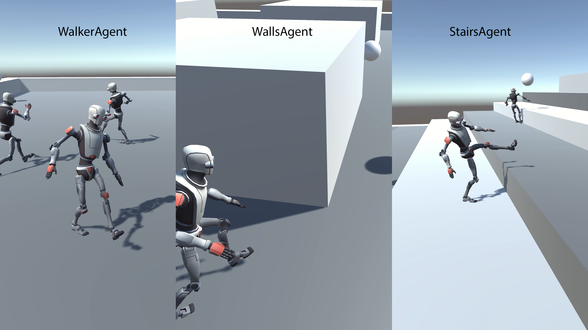
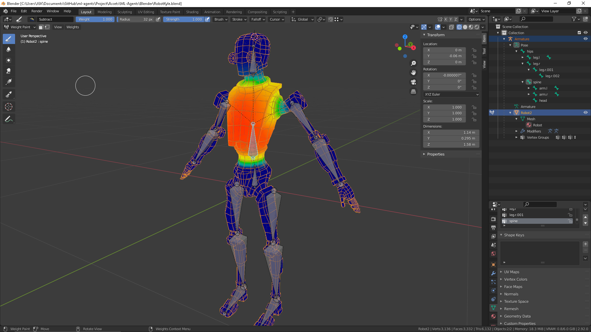

# Ragdoll Trainer Unity Project

Active ragdoll training with Unity ML-Agents (PyTorch). 

## Ragdoll Agent

Based on [walker example](https://github.com/Unity-Technologies/ml-agents/blob/main/docs/Learning-Environment-Examples.md)

The Robot Kyle model from the Unity assets store is used for the ragdoll.

### Features:

* Default Robot Kyle rig replaced with a new rig created in blender. FBX and blend file included.

* Heuristic function inlcuded to drive the joints by user input (for development testing only).

* Added stabilizer to hips and spine. The stabilizer applies torque to help ragdoll balance.

* Added "earlyTraining" bool for initial balance/walking toward target.

* Added WallsAgent prefab for navigating around obstacles (using Ray Perception Sensor 3D).

* Added StairsAgent prefab for navigating small and large steps.

* Added curiosity to yaml to improve walls and stairs training.

---

# Training Process

* Walking:
  1. WalkerAgent
    a. early training = true
    b. steps = 40 million
  2. WalkerAgent
    a. early_training = false
    b. steps = 80 million
* Walls: WalkerAgent (true) -> WalkerAgent (false) -> WallsAgent (false)
* Stairs: WalkerAgent (true) -> StairsAgent (true) -> StairsAgent (false)

---

# How the WalkerAgent Prefab Model Works

This is a brief explanation of how the walkeragent prefab model works in the ragdolltrainer sub project using the ML-Agents framework.

## FixedUpdate()

The `FixedUpdate()` method is where the logic for updating the agent's state and rewards at each fixed timestep is implemented. In the code, several methods are used to calculate different rewards based on the agent's behavior, such as foot spacing, look at target, and match speed. These rewards are then added to the agent's total reward using the `AddReward()` method.

The transform position of the randomly placed target sphere is used in the `UpdateOrientationObjects()` method, which is defined in the `WalkerBase.cs` script. This method is responsible for updating the orientation cube and the direction indicator, which are used to provide visual feedback to the agent and the user. The orientation cube is a transparent cube that rotates to match the target's position, and the direction indicator is a colored arrow that points from the agent's head to the target. The transform position of the target sphere is used to calculate the rotation of the orientation cube and the direction indicator using the `Quaternion.LookRotation()` method.

## CollectObservations(VectorSensor sensor)

The `CollectObservations(VectorSensor sensor)` method is where the observations that the agent collects are defined. In the code, the target's transform position is added as a vector observation using the `sensor.AddObservation()` method. This way, the agent can perceive the location of the target relative to itself.

The transform position of the target sphere is not used directly in the agent's actions, but it affects the agent's rewards and observations, which in turn affect the agent's learning process. The agent learns to maximize its rewards by taking actions that move it closer to the target, while avoiding falling off the platform or crossing its feet. The agent also learns to use its observations to determine the best actions to take in different situations.

## References

* [Unity ML-Agents Tutorials – Complete Machine Learning Guide](https://www.markdownguide.org/basic-syntax/)
* [Unity-Technologies/ml-agents - GitHub](https://www.markdownguide.org/extended-syntax/)
* [Getting Started Guide - GitHub](https://markdown.land/markdown-code-block)
